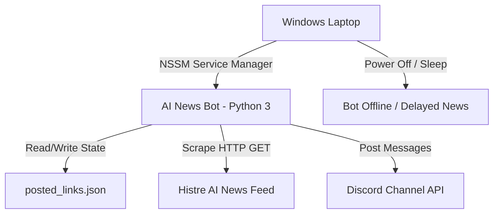

# Migration Plan: Windows Service to Ubuntu 24.04 (Hetzner VPS)

This document serves as the official blueprint and system documentation for migrating the **AI News Bot for Discord** from a local Windows environment to a dedicated cloud server hosted on Hetzner Online.

---

## Executive Summary

The AI News Bot currently runs as a local Windows service utilizing NSSM (Non-Sucking Service Manager) on a personal laptop. This deployment strategy suffers from significant operational limitations, primarily that the bot only functions when the laptop is powered on and connected to the internet. 

To achieve **99.9% uptime**, **secure operation**, and **automated management**, we are migrating the service to a **Hetzner Cloud VPS (ubuntu-4gb-fsn1-4)** running **Ubuntu 24.04 LTS**.

### Key Objectives
1. **High Availability**: Continuous 24/7/365 news scraping and posting.
2. **Zero Duplicate Posts**: Preserving the historical cache of `posted_links.json` during the transition.
3. **Enterprise-Grade Security**: Isolating execution under a dedicated system user, implementing sandboxed configurations, and setting up strict firewall controls.
4. **Resiliency**: Leveraging `systemd` for automated process monitoring, health checks, and self-healing restart loops.

---

## Architecture Overview

### Current System Design (Local Laptop)


### Target System Design (Hetzner VPS)
```mermaid
graph TD
    Hetzner[Hetzner VPS ubuntu-4gb-fsn1-4] -->|systemd Daemon Manager| Bot[AI News Bot - Python 3.12]
    Bot -->|Isolated Packages| Venv[Python 3 Virtual Env]
    Bot -->|Read/Write State| DB[/opt/ai-news-bot/posted_links.json]
    Bot -->|Scrape HTTP GET| Histre[Histre AI News Feed]
    Bot -->|Post Messages| Discord[Discord Channel API]
    Journal[systemd-journald] -->|Collect Log Streams| Bot
    Cron[Constant Uptime 24/7] --> Bot
```

### System Boundaries & Tech Stack
* **Language & Framework**: Python 3.12 (standard package on Ubuntu 24.04 LTS).
* **Scraping Engine**: Beautiful Soup 4 (`bs4`) and `requests` for fetching/parsing Histre's news.
* **Discord Integration**: `discord.py` utilizing async WebSockets for real-time interaction.
* **Persistence Layer**: Flat file JSON data store (`posted_links.json`) containing historical URLs to prevent duplication.
* **Service Orchestration**: Linux `systemd` process manager.

---

## Design Decisions

The migration introduces several core refinements to the operational model, trading local utilities for native Linux daemon features.

| Architectural Dimension | Windows Service (Old) | Ubuntu VPS (New) | Rationale |
| :--- | :--- | :--- | :--- |
| **Service Manager** | NSSM (Non-Sucking Service Manager) | **systemd** | `systemd` is standard on Ubuntu, offering unified logging via `journald`, advanced startup dependency ordering, sandboxing options, and zero dependency on third-party executables. |
| **Privilege Model** | Local User / Administrator | **System Service User (`ainewsbot`)** | Minimizes attack surface. The bot runs under a dedicated account without password login privileges, interactive shell, or sudo rights. |
| **Python Scope** | System-wide install (`C:\Python314`) | **Virtual Environment (`venv`)** | Prevents system-wide dependency pollution. Complies with PEP 668 (externally managed environments on modern Linux distributions). |
| **Log Management** | Custom file writing (`ai_news_bot.log`) | **Dual Stream (`journald` + Local file)** | Preserves the local file log for application debugging while channeling standard out/err to the host system log (`journald`) for system monitoring. |
| **State Continuity** | Local file | **State-migrated file** | Transferring `posted_links.json` keeps the bot's memory intact, preventing hundreds of duplicate posts upon booting on the cloud server. |

---

## Core Components

The bot codebase is extremely compact and modular:
1. **[main.py](file:///d:/GitHub/ai-news-bot/main.py)**: The single application entrypoint.
   * **Initialization**: Loads `.env` configuration and initiates the Discord bot client.
   * **State Management** (Lines 58–84): Handles loading and saving of the `posted_link_ids` set.
   * **Scraper Engine** (Lines 86–232): Makes retried HTTP GET requests to `Histre` with exponential backoff to tolerate brief news site outages.
   * **Worker Thread Loop** (Lines 235–305): Main worker that computes the difference between current posts and memory, formats messages, throttles deliveries to respect Discord rate limits, and persists updated sets to disk.
2. **[requirements.txt](file:///d:/GitHub/ai-news-bot/requirements.txt)**: Minimal dependency file specifying version-locked Python libraries.
3. **[posted_links.json](file:///d:/GitHub/ai-news-bot/posted_links.json)**: Local database containing URLs of posted stories.

---

## Data Models

The persistence schema consists of a single flat JSON list file containing URLs that have already been posted:

### Structure of `posted_links.json`
```json
[
  "https://histre.com/hn/item-url-slug-1",
  "https://news.ycombinator.com/item?id=40283749",
  "https://another-ai-resource.org/article-permalink"
]
```

> [!IMPORTANT]
> Because this file is loaded into memory on startup as a Python `set`, check operations are performed in $O(1)$ time complexity. This ensures high performance even as the database grows to thousands of elements. The disk serialization process is atomic—the file is rewritten upon successful posting of a batch.

---

## Deployment Architecture

### Target Server Specifications
* **Cloud Provider**: Hetzner Online (Falkenstein, Germany or Helsinki, Finland data centers).
* **Server Type**: `cx22` / `ubuntu-4gb-fsn1-4` (virtual machine).
  * **vCPU**: 2 Cores
  * **RAM**: 4 GB (Python runtime occupies ~65 MB, leaving ample headroom).
  * **Disk**: 40 GB NVMe SSD storage.
  * **Network**: 20 TB Traffic allowance (outbound).
* **Operating System**: Ubuntu 24.04 LTS (Noble Numbat), minimal cloud-init image.

### Network Configuration (Firewall Rules)
The server operates under a strict inbound firewalled model:
* **Inbound Rules**:
  * TCP Port `22` (SSH) restricted to authorized admin IPs (recommended) or open globally with public key authentication only.
* **Outbound Rules**:
  * TCP Port `443` (HTTPS) allowed globally (required for scraping `histre.com` and communicating with the Discord API gateway).

---

## Security Model

To protect the server and the sensitive Discord bot token, the target environment is configured with strict security boundaries:

1. **Least Privilege Process Isolation**:
   * The process runs under the system account `ainewsbot`.
   * This user has no password, is locked from SSH logins directly, and does not have a shell (`/sbin/nologin`).
2. **Directory Permissions**:
   * The application directory `/opt/ai-news-bot` is owned exclusively by `ainewsbot:ainewsbot`.
   * Directory permission mask is set to `0750` (read/write/execute for owner, read/execute for group, none for others).
   * File permission mask is set to `0640` (read/write for owner, read-only for group, none for others). This guarantees that other unprivileged users or processes on the server cannot read `.env` to leak `DISCORD_TOKEN`.
3. **systemd Sandboxing**:
   * The systemd unit utilizes native Linux container-like constraints:
     * `NoNewPrivileges=true`: Disallows the process and its children from gaining root privileges via setuid/setgid binaries.
     * `ProtectSystem=full`: Mounts `/usr`, `/boot`, and `/etc` as read-only for the service.
     * `ProtectHome=true`: Makes `/home`, `/root`, and `/run/user` invisible and inaccessible to the bot.
     * `PrivateTmp=true`: Allocates an isolated, temporary `/tmp` directory that is destroyed when the service stops.

---

## Appendix A: Step-by-Step Migration Runbook

Follow these instructions systematically to provision the server, transfer the data, and start the new service.

### Step 1: VPS Provisioning
1. Log in to the **Hetzner Cloud Console**.
2. Select or create a project.
3. Click **Add Server** and choose a location (e.g., Falkenstein `fsn1`).
4. Select the **Ubuntu 24.04 LTS** image.
5. Select the **Shared vCPU / Intel or AMD / CX22 (2 vCPU, 4 GB RAM)** tier.
6. Under **SSH Keys**, add your personal SSH public key.
7. Click **Create & Buy Now**. Note down your new server IP (e.g. `195.201.X.X`).

### Step 2: Server Security Hardening
SSH into the server as `root`:
```bash
ssh root@your_server_ip
```

Update system software:
```bash
apt update && apt upgrade -y
```

Install baseline packages (Python 3 Virtual Environments, Git, UFW Firewall, and JQ utility):
```bash
apt install -y python3-pip python3-venv git ufw jq
```

Configure the Firewall:
```bash
ufw default deny incoming
ufw default allow outgoing
ufw allow ssh
ufw --force enable
```

### Step 3: Service Environment Creation
Create the unprivileged system user and application directory:
```bash
# Create system user
useradd -r -s /sbin/nologin ainewsbot

# Establish deployment folder
mkdir -p /opt/ai-news-bot
chown ainewsbot:ainewsbot /opt/ai-news-bot
chmod 750 /opt/ai-news-bot
```

### Step 4: Transfer Codebase and Database
From your **local Windows machine** using PowerShell, transfer the files directly to the server.

> [!TIP]
> Keep the Windows service running until this step is completed, then disable it to ensure no news events are dropped during the copying process.

```powershell
# In Windows PowerShell, run:
scp D:\GitHub\ai-news-bot\main.py root@your_server_ip:/opt/ai-news-bot/
scp D:\GitHub\ai-news-bot\requirements.txt root@your_server_ip:/opt/ai-news-bot/
scp D:\GitHub\ai-news-bot\.env root@your_server_ip:/opt/ai-news-bot/
scp D:\GitHub\ai-news-bot\posted_links.json root@your_server_ip:/opt/ai-news-bot/
```

### Step 5: Python Virtual Environment Setup
On the **Ubuntu server**, establish the isolated environment and install locked library versions:
```bash
# Set up virtual environment
python3 -m venv /opt/ai-news-bot/venv

# Install requirements using the virtual environment's pip
/opt/ai-news-bot/venv/bin/pip install --upgrade pip
/opt/ai-news-bot/venv/bin/pip install -r /opt/ai-news-bot/requirements.txt
```

Set rigid security permissions on the application folder:
```bash
# Ensure everything is owned by the service user
chown -R ainewsbot:ainewsbot /opt/ai-news-bot

# Set directories to 750 and files to 640
find /opt/ai-news-bot -type d -exec chmod 750 {} \;
find /opt/ai-news-bot -type f -exec chmod 640 {} \;
```

### Step 6: systemd Service Configuration
Create a new service configuration file:
```bash
nano /etc/systemd/system/ainewsbot.service
```

Paste the following configurations into the file:
```ini
[Unit]
Description=AI News Discord Bot Service
After=network-online.target
Wants=network-online.target

[Service]
Type=simple
User=ainewsbot
Group=ainewsbot
WorkingDirectory=/opt/ai-news-bot
ExecStart=/opt/ai-news-bot/venv/bin/python /opt/ai-news-bot/main.py
Restart=always
RestartSec=10

# Hardening & Sandboxing Controls
NoNewPrivileges=true
ProtectSystem=full
ProtectHome=true
PrivateTmp=true

[Install]
WantedBy=multi-user.target
```
Save and close the file (`Ctrl+O`, `Enter`, `Ctrl+X`).

### Step 7: Launch and Enable the Bot Daemon
Instruct systemd to scan for new service definitions, enable the bot to start automatically on machine boot, and spin up the process:
```bash
# Reload systemd configuration cache
systemctl daemon-reload

# Enable service auto-start
systemctl enable ainewsbot.service

# Start the bot service
systemctl start ainewsbot.service
```

### Step 8: Verify Deployment and Check Health
Check if the daemon is running actively and examine the startup logs:
```bash
# Check service health
systemctl status ainewsbot.service

# Stream system journal logs in real-time
journalctl -u ainewsbot.service -n 50 -f
```

Ensure application logging functions are active:
```bash
tail -f /opt/ai-news-bot/ai_news_bot.log
```

> [!TIP]
> Go to your Discord channel and execute the `!test` command. The bot should instantly reply with `Hello! AI News Bot is running.`.

### Step 9: Deprecate the Windows Service
To prevent duplicate scrape actions and potential Discord API conflicts, immediately deactivate the NSSM service on your Windows laptop.

Open **PowerShell as Administrator** on your local machine and run:
```powershell
# Stop the local service
Stop-Service -Name "AI_News_Bot_Service"

# Disable it from starting again on boot
Set-Service -Name "AI_News_Bot_Service" -StartupType Disabled

# Delete the Windows service definition entirely via NSSM (Optional)
# C:\Tools\nssm\nssm.exe remove AI_News_Bot_Service confirm
```

---

## Appendix B: Troubleshooting & Run-time Operations

### 1. How to restart the service on Ubuntu
If configuration changes are made or if the bot gets stuck:
```bash
systemctl restart ainewsbot.service
```

### 2. How to view systemd logs
View logs from the current boot:
```bash
journalctl -u ainewsbot.service --boot
```
Search for warning or error messages in the logs:
```bash
journalctl -u ainewsbot.service -p err
```

### 3. Resolving "DISCORD_TOKEN or CHANNEL_ID not set"
* **Symptom**: The service fails immediately on start, printing this error to stderr.
* **Diagnosis**: The `.env` file is missing, located in the wrong directory, or not readable by `ainewsbot`.
* **Fix**: Ensure `/opt/ai-news-bot/.env` exists, contains the proper values, and has permissions set correctly:
  ```bash
  chown ainewsbot:ainewsbot /opt/ai-news-bot/.env
  chmod 640 /opt/ai-news-bot/.env
  ```

### 4. Backing up the Posted Links Database
It is highly recommended to periodically back up the JSON file. You can create a simple cron job to duplicate the file:
```bash
# Backup command
cp /opt/ai-news-bot/posted_links.json /opt/ai-news-bot/posted_links.json.bak
```

---

## Glossary of Terms

* **VPS**: Virtual Private Server. An isolated virtual machine running its own OS on physical hypervisor hosts.
* **systemd**: A system and service manager for Linux operating systems that initializes system resources and monitors active daemons.
* **journald**: The logging daemon of systemd, which gathers stdout/stderr streams from processes and packages them securely in system logs.
* **Virtual Environment (venv)**: A self-contained directory tree that contains a Python installation for a particular version of Python, plus a number of additional packages.
* **NSSM**: Non-Sucking Service Manager. A Windows helper utility used to wrap command-line applications as Windows services.
